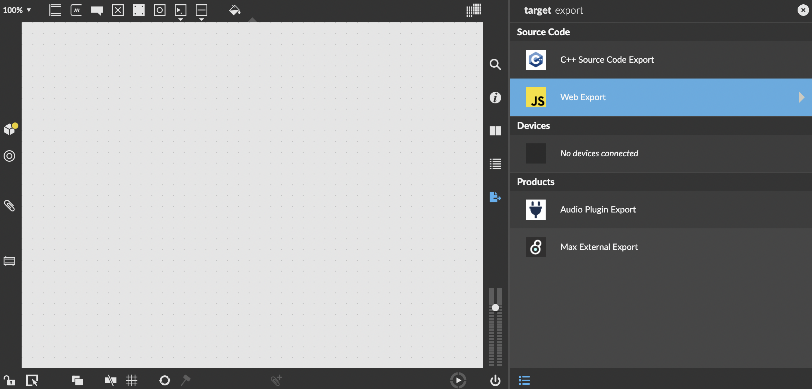

# RNBO Webpage Example

This example shows you how to add dynamic audio to a webpage, using the JavaScript source code export feature of RNBO, part of [Max 8](https://cycling74.com/products/max) made by [Cycling '74](https://cycling74.com).

This repository uses [Node](https://nodejs.org/en/) to launch a simple web server to make your webpage available locally. For more on why this is necessary, see [Why a local server?](#why-a-local-server)

## Prerequisites

In order to run this example, you'll need `node`, `npm`, and access to the command line. The `npx` binary ships with `node`, so just download and install that from the [Node.js downloads site](https://nodejs.org/en/download/). The recommended version is their latest `LTS`, which at the time of writing this document is version 16.

If have heard about `node` and `npm` before but would like to know more about the included `npx` Package Runner please refer to the [Node.js Documentation](https://nodejs.dev/learn/the-npx-nodejs-package-runner).

## File structure

The source code of the web application is in the `js/` directory. This directory contains the file `app.js`, which does all the work of loading and connecting your RNBO patch. There is also a file `guardrails.js`, which simply tries to provide some clear feedback if you're not running this example in the intended way.

Some notable files/directories:

| Location                          | Explanation   |
| --------------------------------- | ------------- |
| export/                           | The directory into which you should export your RNBO code |
| js/                               | Source for the project, edit it however you like |
| index.html                        | The web page itself |

## Using this Template

This Github repo is a template, which means you can use it to start your own git-based project using this repository as a starting point. The major difference between a template and a fork is that your new project won't include the commit history of this template--it will be an entirely new starting point. For more see [the official description](https://docs.github.com/en/repositories/creating-and-managing-repositories/creating-a-repository-from-a-template).

### Getting Started

To get started, first create a new repository to hold your project using this repository as a template. If you're viewing this repo on Github, you should see a button at the top of the page that says `Use this template`. 


You can also follow [the official steps](https://docs.github.com/en/repositories/creating-and-managing-repositories/creating-a-repository-from-a-template) on Github for creating a new repository from a template.

Now you need to copy this repository locally. Follow [the official steps](https://docs.github.com/en/repositories/creating-and-managing-repositories/cloning-a-repository) to clone your repository.

### Working with RNBO

Next, open the RNBO patcher you'd like to work with, and navigate to the export sidebar. Find "JavaScript Export" target.



Export your project, making sure to export into the `export` folder in your repository directory. Your export directory should look something like this:

```
export/
├─ patch.export.json
├─ README.md
```

Whenever you make a change to your RNBO patch, remember to export the source code again to update this file. Now that you've exported your RNBO code, we're ready to open the webpage. From the repository root, run the following command to start the local web server

```sh
npx http-server
```

When asked to install the `http-server` in order to proceed simply agree by using `y`. You will only have to agree on that once.
Once the server started up successfully you may see something like the following in the console:

```sh
Available on:
  http://127.0.0.1:8080
  http://192.168.88.139:8080
Hit CTRL-C to stop the server
```
Open the shown URL, fe. `http://127.0.0.1:8080` in your default browser, if everything went well, you should see and hear your RNBO patch.

### Exporting a new patch

This example looks in the `export` directory for a patch named `patch.export.json`. If you change the name of your export to something other than `patch.export.json`, you'll need to change the JavaScript as well. In `js/app.js`, the line:

```js
const response = await fetch("export/patch.export.json");
```

can be changed to reflect the name of your export.

## Troubleshooting

### Why don't I see anything?

First, check your developer console. On MacOS, you can bring this up in most browsers by pressing Command-Option-I on a Mac. Firefox puts developer tools under Tools > Browser Tools > Web Developer Tools. Other browsers may put this feature somewhere else, so check the documentation for your browser of choice. The important thing to do here is to make sure you don't see any error. If you see something in red, read the message carefully.

### Something doesn't seem to be working right

It might be that the version of RNBO that you used to export your patch doesn't match the version of the RNBO library that `index.html` is downloading. Look for a message in the developer console talking about mismatched versions. To fix this, either export a version of your patch using a more up-to-date version of RNBO, or else change the `script` tags in `index.html` to download a different version of the RNBO libraries.

### My samples aren't loading correctly

Again check the developer console, this time looking for error messages about a failure to decode audio data. Some browsers, like Chrome for example, don't support decoding `.aif` files. So if you're using `anton.aif` as a sample dependency, you should export again using `anton.wav`. Or maybe find another sample to use.

### Why isn't my patch changing in the browser?

If you changed your exported patch in the `export` folder but your patch isn't changing in the browser, you might need to hard refresh the page (cmd+shift+R). This clears the cache to account for any changes to the page being served.

## Why a local server?
We're recreating on a very small scale what happens whenever you load a website on your computer. When you run `npx http-server`, a Node process starts. This process binds to a port on your machine, defaulting to port 8080. When your browser tries to access the website `http://localhost:8080`, it connects to the server and tries to get the content for the given path, which is `/`. Given this path, the server returns the contents of the file `index.html`, which is what you see when you load the page.

As part of loading that page, your web browser also asks the server for the JavaScript file at `js/app.js`. When the browser executes this script, it makes yet another request to fetch the file at the path `export/patch.export.json`. Finally, the script can use this exported patch to create a RNBO JavaScript object and connect it to the audio graph in the current page.

The important takeaway here is that this is the kind of interaction that your browser is expecting: making HTTP and HTTPS requests to fetch resources from a remote server. It's technically possible to simply double-click on the `index.html` file and to load the page using the `file:` protocol instead of `http:` or `https:`. However, for security reasons this will block access to `WebAssembly` or `AudioWorklets`, which will keep our exported RNBO patch from working the way we want. Running a local server lets the browser treat the webpage as if it were pulled from the internet like any other page.

The other reason that we run a server this way is because this brings us much closer to putting our RNBO patch on the publically accessible internet. If you want to build a public website containing a RNBO patch, it's helpful to keep this simple example in mind when you think about what resources to put where.

## Customizing your web page

From this point, the sky is the limit. You can do anything and everything to your web page, adding custom graphics and interaction in whatever way you like. A full discussion of web programming is beyond the scope of this README, but some useful reading material would include:

- [ReactJS](https://reactjs.org/)
- [p5JS](https://p5js.org/)
- [Canvas API](https://developer.mozilla.org/en-US/docs/Web/API/Canvas_API/Tutorial)
- [Netlify](https://www.netlify.com/)
